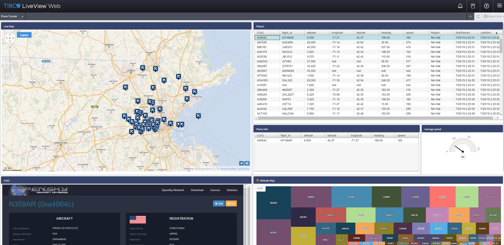

# LiveViewTM Plane Tracker Sample

This sample decodes airplane information using SDR (Software Defined Radio) and third party software called dump1090. It parses airplane data into tuples and publishes to LiveViewTM Server using a StreamBase® eventflow application. You can use LiveViewTM Web on localhost:10080 in a web browser to see plane data in your area to be displayed on a live map. You can also view additional details for each plane using a customized LiveViewTM Web card to show airplanes's manufacturing and ownership information if any.

# Prerequisites

* OS: Windows 10
* JDK: 8
* StreamBase StudioTM: 10.4.3

# Setup

* Clone this repository https://github.com/tonywang1997/PlaneTracker_TIBCO.git to your local machine (currently only supports Windows) and import into StreamBase StudioTM as Maven project.

* Open PlanePublisher.sbapp in src/main/eventflow and double click the InputAdaptor icon. In the property tab for InputAdaptor, change the Region parameter to your location following the format of NA-Bos (North America - Boston).

* Download the USB driver on https://zadig.akeo.ie/

* Connect your SDR to the USB port and click "Cancel" when Windows begins installing the drivers. Then install the SDR using the USB driver you just downloaded by following the instructions on the website.
	* This sample was tested using the Nooelec R820T SDR
	
* Extract dump1090.zip to src/main/resources or clone the file from https://github.com/MalcolmRobb/dump1090 into the same folder and open it in your system explorer. Then double click dump.bat in your system explorer to run the application which will start to listen and decode radio signals in the range of your SDR.
	* Note: dump.bat will open dump.exe in a terminal window with specific configuration for you to see plane data. If a terminal window failes to open, try reconnecting to your SDR or reinstalling the driver.
	
	
	
* After you can see data showing in the terminal window, from StreamBase Studio right click on PlaneTracker and choose run as LiveViewTM Fragment.
	
* Once the sample has successfully loaded, run LiveView Web by typing localhost:10080 into a browser. Look for plane data publishing to LiveView server and also planes moving on the embedded GeoMap.

	

	
* TIBCO LiveViewTM Web also includes a customized visualization card which can render a third party web site displaying the plane detail once you select a plane from the map or in card "Planes". Look for the custom card's resource file in src/main/liveview/lv-web/plugins/com.tibco.sb.ldm.web.plugins.queryiframe
	
	
	  