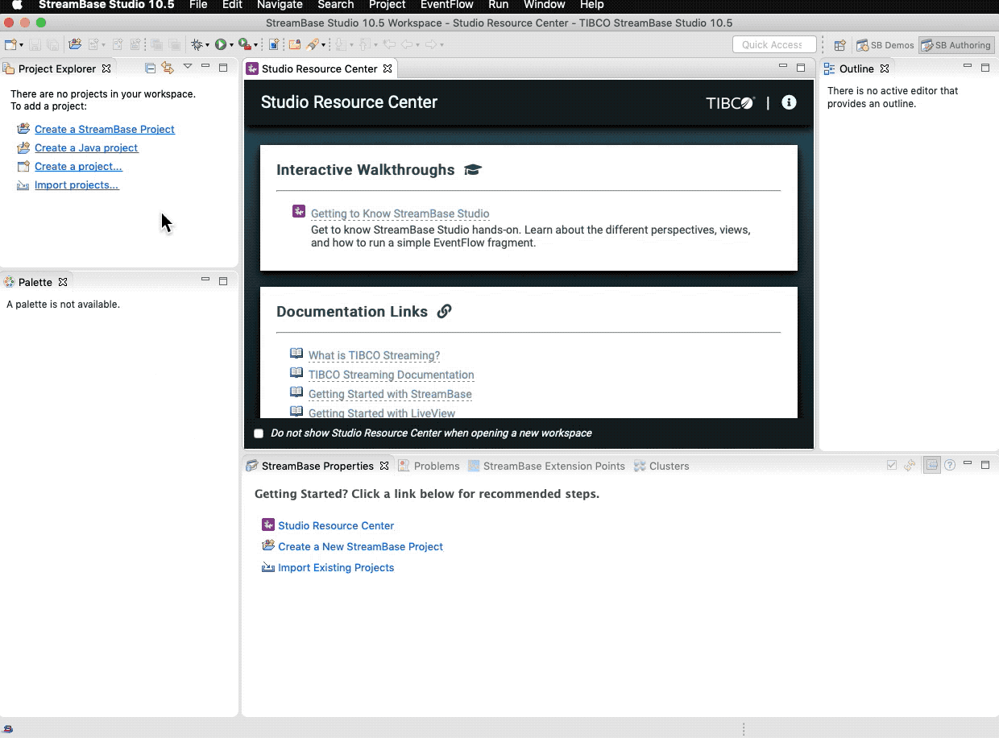
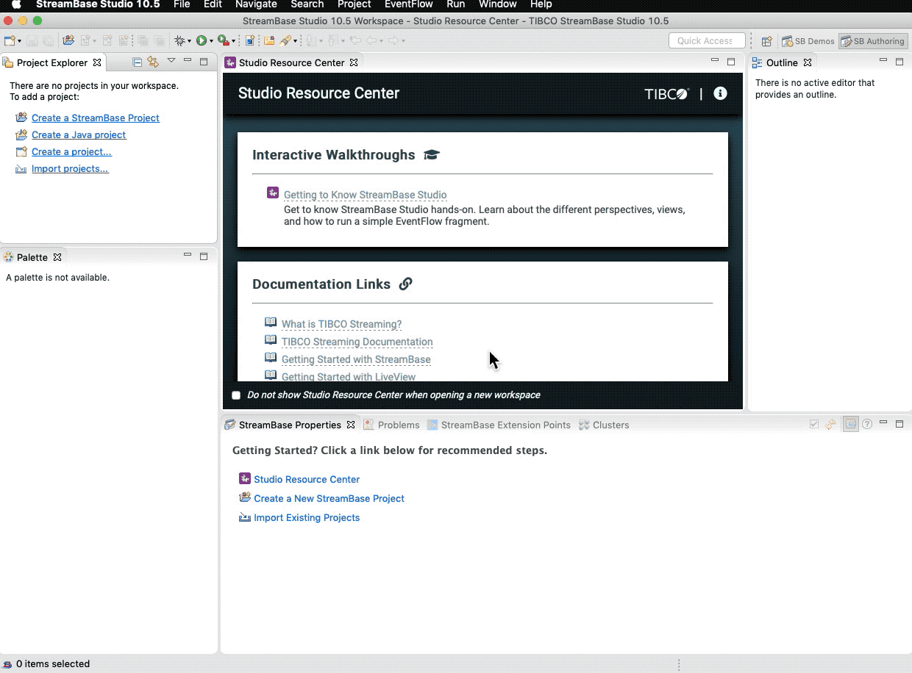
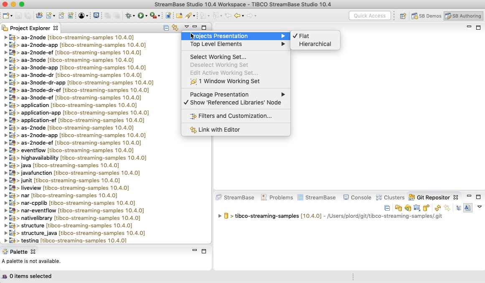

# Using in TIBCO StreamBase Studio&trade;

These samples are kept on-line in github - this allows browsing of the samples on-line,
support of contributions outside of TIBCO engineering and updates outside of the main
product release lifecycle.

The samples can also be imported into TIBCO StreamBase Studio&trade; :

## Import using TIBCO StreamBase Studio&trade;

* Use **File -> Load StreamBase Sample...** menu option.
* Agree to TIBCO&reg; Streaming Community terms and conditions.
* Choose what sample(s) to import:

This will create a copy the projects to the workspace and any changes to the imported projects will not modify the git checkout. To work with the cloned repository directly, follow the steps to import a project with the Maven importer.

## Using the Maven Importer

* Copy the path of the git checkout. You can find its location from **File -> Load StreamBase Sample...** menu option, and clicking on the **Open repository clones in system explorer** link. The location can also be opened from the StreamBase Studio preferences page.
* Use **Import -> Maven -> Existing Maven Projects** menu option.
* Paste the path to the cloned repositories.
* Choose what sample(s) to import:

## Working with multiple projects

By default, projects are organized in TIBCO StreamBase Studio&trade; in a flat structure :

With multiple projects ( such as importing all the samples ) this can become confusing.  Use
**Projects Presentation -> Hierarchical** for a more structured organization :

## Other useful eclipse plugins

* [Markdown Text Editor](https://marketplace.eclipse.org/content/markdown-text-editor)
* [GitHub Flavored Markdown viewer plugin](https://marketplace.eclipse.org/content/github-flavored-markdown-viewer-plugin)
* [Mylyn WikiText](https://marketplace.eclipse.org/content/mylyn-wikitext)
* [Docker tooling](https://marketplace.eclipse.org/content/eclipse-docker-tooling) ( requires [TM Terminal](https://marketplace.eclipse.org/content/tm-terminal) )
* [Eclipse Copyright Generator](https://jmini.github.io/Eclipse-Copyright-Generator/)